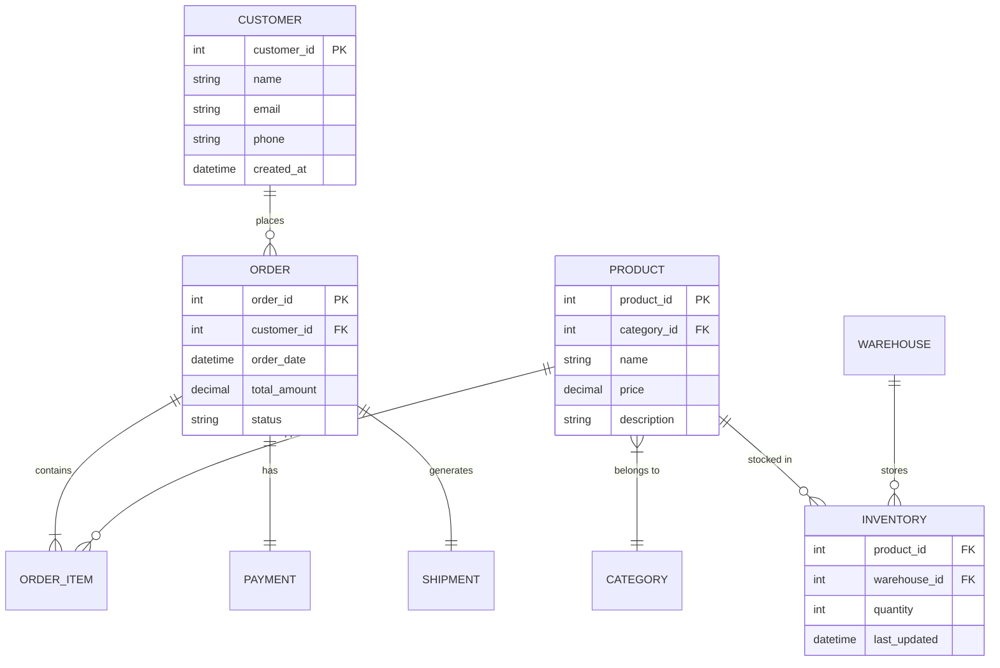

# Relational Database Design — E-Commerce Order Management System

> A normalized relational database schema for managing customers, products, orders, and inventory in an e-commerce context.

## Overview

This project addresses the challenge of designing a robust database system for an e-commerce platform. The goal was to create a schema that handles complex relationships between customers, products, orders, and inventory while maintaining data integrity and query performance.

## System Context

**Business Domain:**
- Multi-vendor e-commerce platform
- Customer account management
- Product catalog with categories and pricing
- Order processing and fulfillment
- Inventory tracking across warehouses

**Stakeholders:**
- Operations teams managing orders
- Warehouse staff tracking inventory
- Customer service resolving order issues
- Analytics teams generating reports

## Architecture



## Design Decisions & Trade-Offs

| Decision | Rationale |
|:---------|:----------|
| **3NF Normalization** | Eliminates redundancy; ensures update/delete anomalies are prevented. |
| **Surrogate keys (auto-increment)** | Simplifies joins; avoids composite key complexity. |
| **Separate ORDER_ITEM table** | Enables many-to-many between orders and products; stores line-item quantity and price snapshot. |
| **Price snapshot in ORDER_ITEM** | Captures historical pricing at time of purchase, independent of current product price. |
| **Indexed foreign keys** | Optimizes JOIN performance on high-frequency queries (order lookups, inventory checks). |

## Implementation Approach

### Schema Design

**Core Tables:**
- `CUSTOMER`: Customer profiles and contact information
- `PRODUCT`: Catalog with pricing and category association
- `CATEGORY`: Product classification hierarchy
- `ORDER`: Header-level order information
- `ORDER_ITEM`: Line items linking orders to products
- `INVENTORY`: Stock levels per product per warehouse
- `WAREHOUSE`: Location and capacity information
- `PAYMENT`: Payment method and transaction details
- `SHIPMENT`: Delivery tracking and status

### Constraints & Integrity

```sql
-- Example: Ensuring valid order status
ALTER TABLE orders
ADD CONSTRAINT chk_status 
CHECK (status IN ('pending', 'processing', 'shipped', 'delivered', 'cancelled'));

-- Example: Preventing negative inventory
ALTER TABLE inventory
ADD CONSTRAINT chk_quantity CHECK (quantity >= 0);
```

### Query Patterns

**Order Summary with Customer Details:**
```sql
SELECT 
    o.order_id,
    c.name AS customer_name,
    o.order_date,
    o.total_amount,
    o.status
FROM orders o
JOIN customers c ON o.customer_id = c.customer_id
WHERE o.order_date >= CURRENT_DATE - INTERVAL 30 DAY;
```

**Low Stock Alert:**
```sql
SELECT 
    p.name AS product_name,
    w.warehouse_name,
    i.quantity
FROM inventory i
JOIN products p ON i.product_id = p.product_id
JOIN warehouses w ON i.warehouse_id = w.warehouse_id
WHERE i.quantity < 10
ORDER BY i.quantity ASC;
```

## Results & Impact

- **Data Integrity**: Referential constraints ensure no orphaned records.
- **Query Performance**: Indexed foreign keys enable sub-second lookups on order and inventory tables.
- **Scalability**: Normalized design supports growth without schema restructuring.
- **Maintainability**: Clear separation of concerns allows independent updates to customer, product, or order logic.

## Limitations & Next Iteration

- **No soft deletes**: Current design uses hard deletes; a production system would add `is_active` flags for audit trails.
- **Single currency**: Schema assumes one currency; multi-currency support would require additional columns or a currency table.
- **No versioning**: Product changes overwrite existing records; future iteration would add product history table.

## Tools & Technologies

`SQL` `PostgreSQL` `ER Diagrams` `Database Normalization` `Indexing`

---

*Note: This repository documents a professional system case study.*
*Source code is private or internal.*

---

*Built by Aimal Khan — Data Engineer & Automation Specialist*
